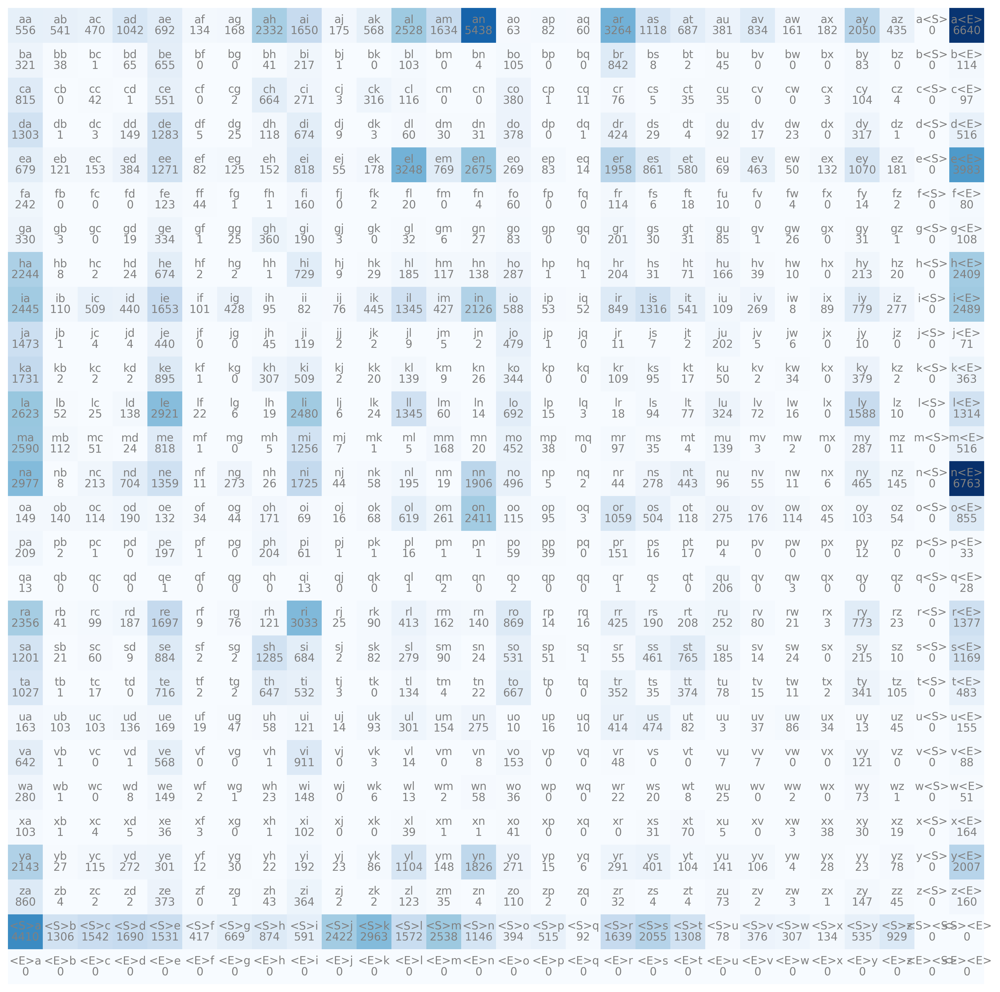

# README.md

## Data Understanding

This document provides a detailed overview of the **names.txt** dataset and outlines the steps involved in building a bigram model using a single-layer neural network.

---

### Dataset Overview

- **File Name**: `names.txt`
- **Total Names**: 3203
- **Word Length**:
  - **Min Length**: 2 letters
  - **Max Length**: 15 letters
  - **Total Characters**: 32,033

### Sample Data

Below is a sample list of 10 names extracted from the dataset:

```python
['emma', 'olivia', 'ava', 'isabella', 'sophia', 'charlotte', 'mia', 'amelia', 'harper', 'Evelyn']
```

### Statistical Insights

1. **Character Distribution**:
   - The dataset comprises names with varying lengths, providing rich diversity in name structures.
   
2. **Top Bigrams**:
   - The dataset was analyzed for bigram frequency, revealing the following insights:
     - **Bigram counts**:
       - `('n', '<E>')`: 6763 occurrences
       - `('a', '<E>')`: 6640 occurrences
       - `('a', 'n')`: 5438 occurrences
       - `('<S>', 'a')`: 4410 occurrences
       - `('e', '<E>')`: 3983 occurrences
       - `('a', 'r')`: 3264 occurrences
       - `('e', 'l')`: 3248 occurrences
   - **Observation**:
     - Names frequently end with letters like `n` and `a`.
     - The bigram `('a', 'n')` is highly prevalent, reflecting common letter combinations.

---

## Bigram Model

The bigram model predicts the probability of the next character based on the current character, allowing for the generation of names that follow the underlying patterns in the dataset.

### Steps to Build the Bigram Model

1. **Count-Based Analysis**:
   - Using the dataset, bigram counts were calculated for all character pairs.
   - These counts form the basis for generating a probability distribution.

2. **Probability Map**:
   - Probabilities are computed by normalizing the bigram counts.
   - For a given character \(c_i\), the probability of the next character \(c_{i+1}\) is given by:
     \[
     P(c_{i+1} | c_i) = \frac{\text{Count}(c_i, c_{i+1})}{\sum \text{Count}(c_i, c_j)}
     \]


3. **Sampling Technique**:
   - A multinomial distribution is used to sample the next character based on the probability distribution.

---

### Neural Network Implementation

To enhance the bigram model, a **single-layer neural network** is implemented. The following steps outline the process:

1. **Input Representation**:
   - Each character is one-hot encoded to form a vector of size 27 (26 letters + start/end token).

2. **Model Architecture**:
   - **Single-Layer Neural Network**:
     - Input: One-hot encoded vector representing the current character.
     - Output: Probability distribution over the next character.
     - Activation Function: Softmax to ensure the output is a valid probability distribution.


3. **Training**:
   - Loss Function: Cross-Entropy Loss.
   - Optimizer: Stochastic Gradient Descent (SGD) or Adam.
   - Training Process: Minimize the loss by updating weights, ensuring the predicted probabilities align with the actual next characters.

