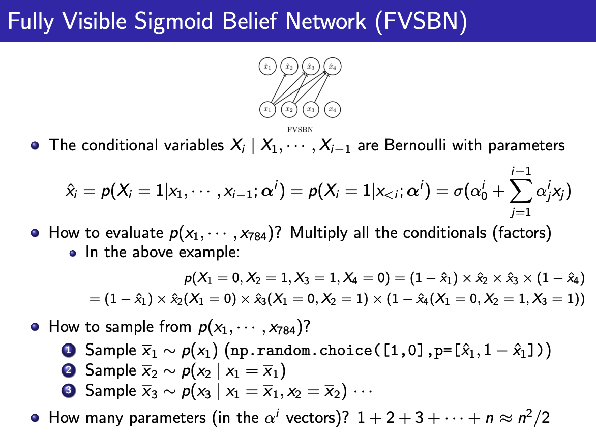

# Fully Visible Sigmoid Belief Network (FVSBN)

## Introduction

The Fully Visible Sigmoid Belief Network (FVSBN) is a directed graphical model used for probabilistic modeling of multivariate discrete distributions. It represents the joint probability distribution of a sequence of variables as a product of conditional probabilities.

## Key Features

- Models joint distribution of input data
- Enables sampling of new data points
- Allows computation of log-likelihood for observed data during training

## Mathematical Overview

For a sequence of variables X = {x₁, x₂, ..., xₙ}, the joint probability distribution is factorized as:

$$p(X) = p(x₁) \cdot p(x₂|x₁) \cdot p(x₃|x₁,x₂) \cdots p(xₙ|x₁,x₂,\ldots,x_{n-1})$$

The conditional probability for each variable xᵢ is modeled using the sigmoid function:

$$p(x_i|x_1,x_2,\ldots,x_{i-1}) = \sigma(a_i)$$

Where:

$$\sigma(a_i) = \frac{1}{1 + e^{-a_i}}$$

$$a_i = b_i + \sum_{j=1}^{i-1} w_{ij}x_j$$

- bᵢ: bias term for xᵢ
- wᵢⱼ: weight connecting xⱼ to xᵢ

## Implementation

The FVSBN can be implemented using formulation of conditional probailbity

## Training

The model is typically trained using maximum likelihood estimation. The objective is to maximize the log-likelihood of the observed data:

$$\log p(X) = \sum_{i=1}^n \log p(x_i|x_1,\ldots,x_{i-1})$$

Optimization techniques such as stochastic gradient descent can be used to update the model parameters.

## Advantages

1. Tractable likelihood computation
2. Efficient sampling procedure
3. Ability to model complex dependencies between variables

## Limitations

1. Fixed ordering of variables
2. Potential difficulty in capturing long-range dependencies
3. May require a large number of parameters for high-dimensional data

## Applications

- Natural language processing
- Image generation
- Anomaly detection
- Density estimation

## References

1. Neal, R. M. (1992). Connectionist learning of belief networks. Artificial intelligence, 56(1), 71-113.
2. Frey, B. J., Hinton, G. E., & Dayan, P. (1996). Does the wake-sleep algorithm produce good density estimators? In Advances in neural information processing systems (pp. 661-667).

Citations:
[1] https://en.wikipedia.org/wiki/Joint_probability
[2] https://stats.libretexts.org/Courses/Saint_Mary's_College_Notre_Dame/MATH_345__-_Probability_(Kuter)/5:_Probability_Distributions_for_Combinations_of_Random_Variables/5.1:_Joint_Distributions_of_Discrete_Random_Variables
[3] http://proceedings.mlr.press/v15/larochelle11a/larochelle11a.pdf
[4] https://www.milefoot.com/math/stat/rv-jointdiscrete.htm
[5] https://www.youtube.com/watch?v=jECS94wCzXQ
[6] https://www.probabilitycourse.com/chapter5/5_2_1_joint_pdf.php
[7] https://deep-generative-models.github.io/files/ppt/2020/Lecture%205%20Autoregressive%20Models.pdf
[8] https://deepgenerativemodels.github.io/notes/autoregressive/

